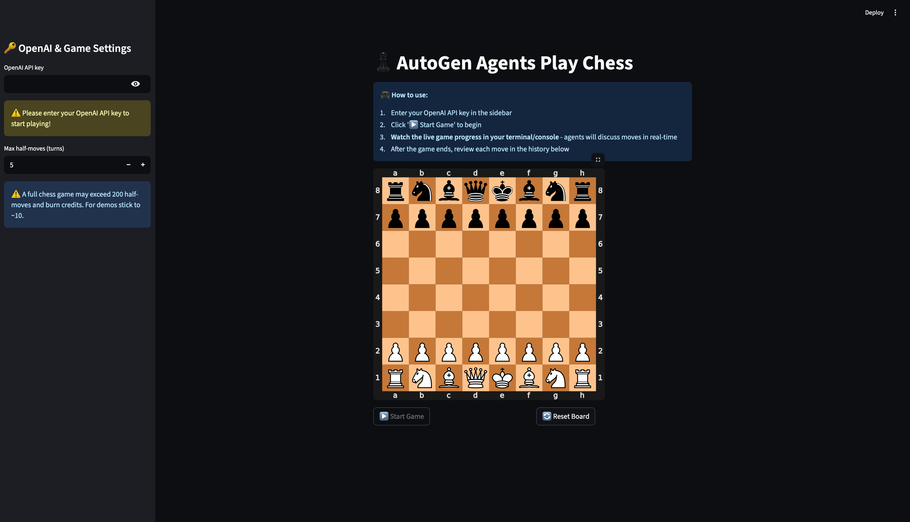
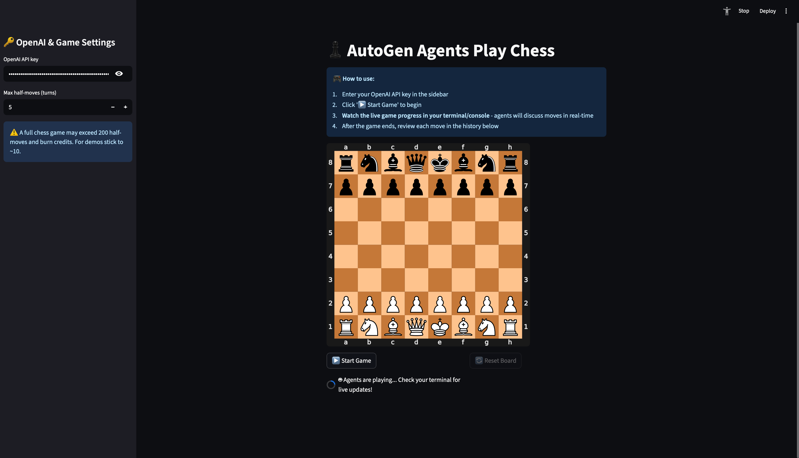
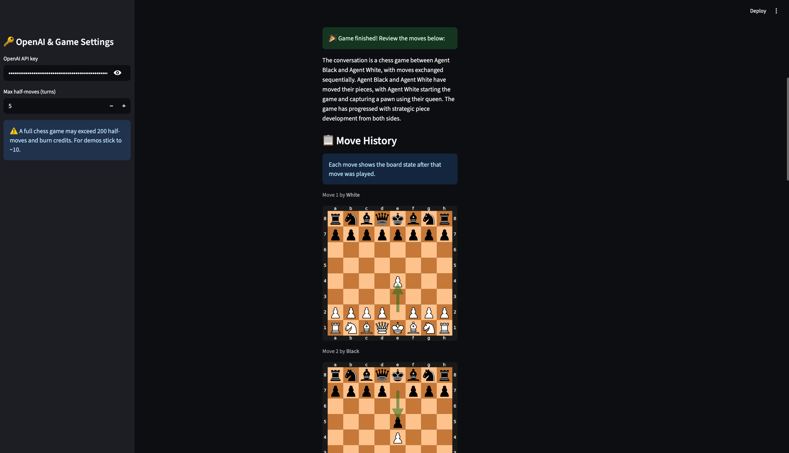
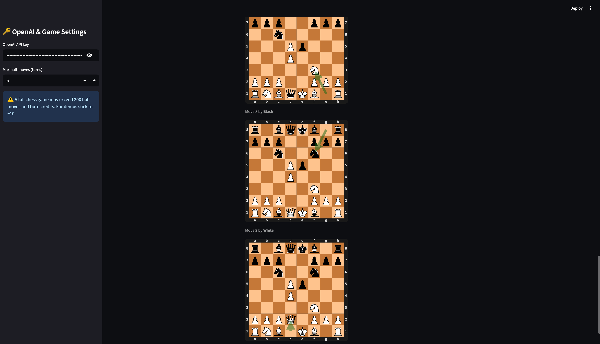

# ♟️ Chess AI Agents

<div align = "center">


</div>

Presenting a chess face-off between **AI Agents** using Microsoft's AutoGen. Watch AI agents debate moves, plan strategies, and play chess in real-time with full visualization of every move and their decision-making process.



## Table of Contents

- [Project Structure](#project-structure)
- [Installation](#installation)
  - [Prerequisites](#prerequisites)
  - [Install uv](#install-uv)
  - [Setup Project](#setup-project)
- [What is AutoGen?](#what-is-autogen)
- [Usage](#usage)
  - [Running the Application](#running-the-application)
  - [What to Expect](#what-to-expect)
- [How It Works](#how-it-works)
  - [Agent Architecture](#agent-architecture)
  - [Game Flow](#game-flow)
- [Author](#author)
- [License](#license)

## Project Structure

```
chess_ai_agents/
├── agents/                # AI agent definitions and setup
│   ├── __init__.py
│   ├── functions.py       # Chess move functions for agents
│   └── setup_agents.py    # Agent initialization and game logic
├── config/                # Configuration settings
│   ├── __init__.py
│   └── settings.py        # Default model, turns, board size
├── core/                  # Core game state management
│   ├── __init__.py
│   └── game_state.py      # Chess board state and session management
├── assets/                # Screenshots and demo images
├── app.py                 # Main Streamlit application
├── pyproject.toml         # Project dependencies and metadata
└── README.md
```

## Installation

This project uses [uv](https://github.com/astral-sh/uv) for fast Python package management.

### Prerequisites

- Python 3.11 or higher
- An OpenAI API key
- uv package manager

### Install uv

```bash
# macOS/Linux
curl -LsSf https://astral.sh/uv/install.sh | sh

# Windows
powershell -c "irm https://astral.sh/uv/install.ps1 | iex"

# Or via pip
pip install uv
```

### Setup Project

**Clone the repository**
```bash
git clone https://github.com/luuisotorres/chess_ai_agents.git
cd chess_ai_agents
```

**Install dependencies**
```bash
uv sync
```

**Activate the virtual environment**
```bash
source .venv/bin/activate  # On macOS/Linux
# or
.venv\Scripts\activate     # On Windows
```

### Settings Customization
Edit `config/settings.py` to modify:

```python
DEFAULT_MODEL: str = "gpt-4o"          # OpenAI model to use
DEFAULT_MAX_TURNS: int = 5             # Default game length
SVG_SIZE: int = 512                    # Chess board display size
```

## What is AutoGen?

[Microsoft AutoGen](https://github.com/microsoft/autogen) is a framework for building **multi-agent AI systems** where AI agents **collaborate, debate, and solve complex problems together**.


## Usage

### Running the Application

**Start the Streamlit app**
```bash
uv run streamlit run app.py
```

**Open your browser** to `http://localhost:8501`

**Enter your OpenAI API key** in the sidebar

**Configure game settings** (optional):
- Adjust max half-moves (default: 5 for demos)
- Higher values = longer games = more API costs

**Click "▶️ Start Game"** and watch the AI play against each other!

### What to Expect

**During the Game:**
- The Streamlit interface shows a spinner: "*Agents are playing...*"
- **Check your terminal/console** for live agent conversations
- Agents will debate moves, analyze positions, and make decisions
- Each move is validated and executed in real-time

**After the Game:**
- View the complete move history in the web interface
- Each move shows the board state after execution
- Game summary with final results







## How It Works

### Agent Architecture

1. **White Agent**: Plays as white pieces, analyzes positions from white's perspective
2. **Black Agent**: Plays as black pieces, considers black's strategic goals  
3. **Game Master**: Orchestrates turns, validates moves, manages game state

### Game Flow

1. **Initialization**: Agents are created with chess-specific instructions
2. **Turn Management**: Game Master alternates between white and black agents
3. **Move Discussion**: Agents analyze current position and propose moves
4. **Move Validation**: Proposed moves are checked for legality
5. **Move Execution**: Valid moves are applied to the board
6. **State Update**: Board state is updated and visualized
7. **Termination**: Game ends after max turns or checkmate/stalemate

## Author

[Luis Fernando Torres](https://github.com/luuisotorres)

[](https://www.linkedin.com/in/luuisotorres/)
[](https://medium.com/@luuisotorres)
[](https://www.kaggle.com/lusfernandotorres)
[](https://huggingface.co/luisotorres)


## License

This project is licensed under the MIT License. See the [LICENSE](LICENSE) file for details.